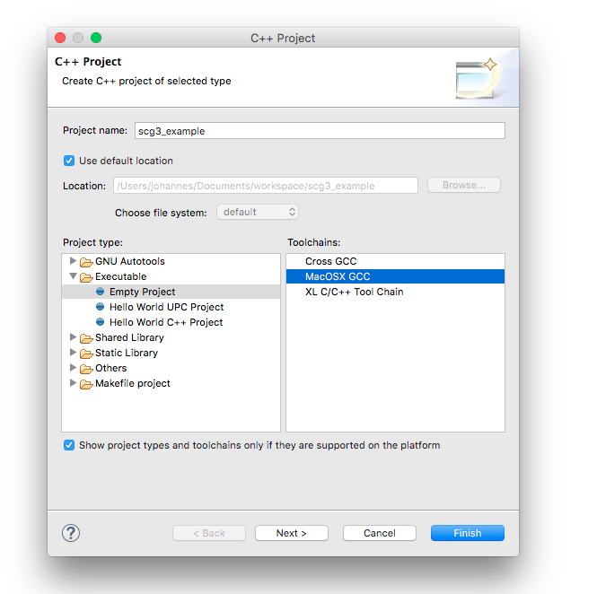

# SCG3 in Eclipse unter Mac OSX Einrichten

Diese Anleitung wurde mit folgendem System erstellt:

Beschreibung | Version bzw. Details
|:-- |:--
Betriebssystem | OS X 10.11.4 (15E65)
Display | 15,4-Zoll, 1680 x 1050 Pixel, NVIDIA GeForce GT 650M 1024 MB
Eclipse Version | Mars.1 Release (4.5.1) 20150924-1200

Beschreibung | Version
|:-- |:--
Xcode | Version 7.3 (7D175)
CDT | 8.8.1
GLFW | 3.1.2
GLEW | 1.13.0

## Vorbereitungen

Installiere alle notwendigen Bibliotheken und Software hierzu wird teilweise [Homebrew](http://brew.sh/) verwendet welches evtl. vorher installiert werden musst. 

1. Installiere Xcode
2. Installiere CDT in in Eclipse über *Help > Install New Software* https://www.eclipse.org/cdt/downloads.php
3. Installiere GLEW per Terminal und [Homebrew](http://brew.sh/): ```brew install glew```
4. Installiere GLFW: ```brew install glfw3```

Lade den Scenegraph [scg3](https://github.com/vahlers/scg3/archive/master.zip) von GitHub herunter und extrahiere die Dateien. In Eclipse müssen zwei Projekte angelegt werden.

## scg3 Projekt in Eclipse anlegen

Die Schritte 1. und 2. können evtl. auch übersprungen werden.

1. Neues Projekt in Eclipse anlegen.
 *New C++ project > Static Library > Empty Project + Select MacOSX GCC*
 
 
 
2. Eclipse wieder schließen.
3. Kopiere alle Dateien welche im Ordner scg3 (extrahierte GitHub Master Dateien ```scg3-master > scg3```) enthalten sind in den Eclipse Ordner in deinem Workspace und ersetzte dabei alle vorhandenen Dateien. Achte vorallem darauf auch die versteckten Dateien *.cproject* und *.projekt* zu ersetzen.

4. Eclipse erneut öffnen.
5. Rechtklick auf *Projekt > Refresh*

6. Beim Klicken auf *Projekt > Rechtsklick > Build Configurations* sollte folgendes sichtbar sein. 

7. Wähle bzw. aktiviere *Projekt > Rechtsklick > Build Configurations > Set Active > DebugOSX*
8. Bevor das Projekt kompiliert werden kann müssen die Einstellungen unter *Projekt > Rechtsklick > Properties* bzw. ```CMD + i``` überprüft und evtl. angepasst werden. Die wichtigsten Einstellung sind bereits durch den Import des Projekts (3.) mit importiert worden, in der Regel fehlen jedoch teilweise die Pfadangangen zu den Bibliotheken. Diese können teilweise von System zu System unterschiedlich sein. In diesen Fall mussten ```/usr/local/lib``` und ```/usr/local/include``` manuell ergänzt werden.

###Settings
*Properties >* **Im Fenster Links:** *C/C++ Build > Settings* 

**Im Fenster Rechts:** *Tool Settings > GCC C++ Compiler > Includes* füge die Pfade ```/usr/local/include``` und ```/usr/local/lib``` hinzu. 


**Im Fenster Rechts:** *Tool Settings > GCC C++ Compiler > Miscellaneous* für C++ Version 11 wird in Other flags folgender Inhalt benötigt: ```[anderer Inhalt] -std=c++0x```.


**Im Fenster Rechts:** *Binary Parsers*


**Im Fenster Rechts:** *Build Artifact*


###Tool Chain Editor
*Properties >* **Im Fenster Links:** *C/C++ Build > Tool Chain Editor* 

**Im Fenster Rechts:** Setze das Dropdown *Current toochain auf MacOSX GCC* und das Dropdown *Current builder auf Gnu Make Builder*.


## sgc3_example in Eclipse anlegen welches scg3 verwendet

Die Schritte 1. und 2. können evtl. auch übersprungen werden. Die Schritte 1. und 2. werden jedoch z.B. für ein eigenes Projekt benötigt.

1. Neues Projekt in Eclipse anlegen.
 *New C++ project > Executable > Empty Project + Select MacOSX GCC*
 
 
 
2. Eclipse wieder schließen.
3. Kopiere alle Dateien welche im Ordner scg3 (extrahierte GitHub Master Dateien ```scg3-master > scg3_example```) enthalten sind in den Eclipse Ordner in deinem Workspace und ersetzte dabei alle vorhandenen Dateien. Achte vorallem darauf auch die versteckten Dateien *.cproject* und *.projekt* zu ersetzen.

4. Eclipse erneut öffnen.
5. Rechtklick auf *Projekt > Refresh*.
6. Beim Klicken auf *Projekt > Rechtsklick > Build Configurations* sollte das gleiche wie beim scg3 Projekt (6.) sichtbar sein.
7. Wähle bzw. aktiviere *Projekt > Rechtsklick > Build Configurations > Set Active > DebugOSX*
8. Die Einstellungen sollten wie auf den folgenden Bilder gesetz werden.
 
 
 
 
 
 
 

```
Andere evtl. nötige Einstellungen.
Library search path = "${workspace_loc:/scg3/Debug}" (for Debug configuration) 
Library search path = "${workspace_loc:/scg3/Release}" (for Release configuration)
```

Nachdem diese Einstellungen überprüft und gesetzt wurden kann versucht werden das Projekt zu kompilierern. Evtl. kann es manchmal hilfreich sein vor dem Kompilieren *Projekt > Rechtsklick > Clean Projekt* auszuführen.

*Projekt > Rechtsklick > Build Project*


